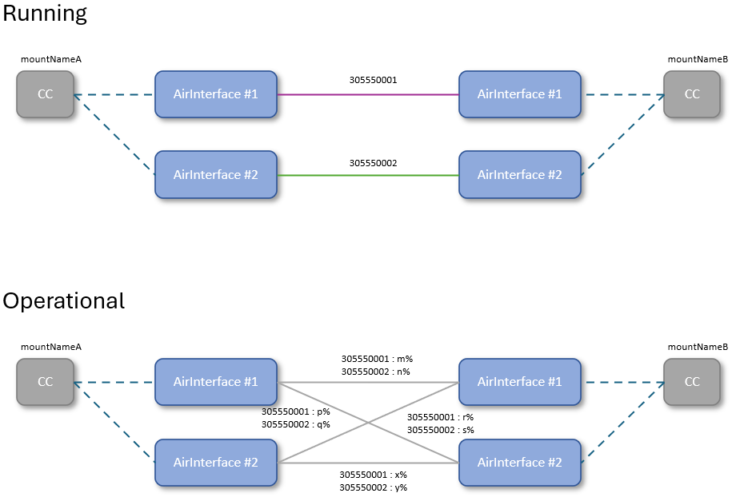

# Information Structure  

The internal data stores shall be structured according to the NMDA concepts ([IETF RFC 8342](https://datatracker.ietf.org/doc/html/rfc8342)).

The specified data stores are assigned the following semantic meanings:  
- The offered services (paths at API) shall allow transferring the planning data into the CandidateDataStore.  
- After some validation tests, the planning data shall be copied into the RunningDataStore.  
- The information provided by the devices in the live (via MWDI, mostly from cache) network shall be consolidated into the OperationalDataStore.  

  

This means for the Link objects:  
- A Link object inside the RunningDS is describing a planned microwave link that _is actually_ identified with a LinkID.  
- The Link objects inside the OperationalDS are describing relationships between AirInterface objects that _might_ correspond to a planned microwave link with a specific LinkID.  

Because the devices cannot provide information about the connections in between them, inside the OperationalDS ... 
- ... an AirInterface might be referenced by several Link objects that are connecting it with several other AirInterfaces and ...  
- ... the individual Link object might correspond to diverse planned microwave links.  

  

Each of the Link objects in the OperationalDS defines a set of Scores that assess the likelihood that this Link object corresponds to one of the planned microwave links.

So, the overall problem of writing the most likely LinkID into the externalLabel attribute at some AirInterface is sub-structured into the following activities on the data stores:  
- The respective Score for a Link object in the OperationalDS to correspond to one of the planned microwave links in the RunningDS is estimated. This calculation compares the information about the planned microwave links in RunningDS with the information retrieved from the actual devices in the OperationalDS. The _resulting estimate is documented at the Link object in the OperationalDS_.  
- Based on the estimated Scores, the most likely distribution of the LinkIDs across the Link objects is calculated. Rules (such as: each LinkID may be assigned just once) must be observed. The _resulting assignments of LinkIDs are documented in the calculatedLinkId attribute at the Link object in the OperationalDS_.  
- If there would be differences between the values of the calculatedLinkId attribute at the Link objects and the LinkId attribute at the AirInterface objects (both in OperationalDS), the values from the calculatedLinkId attribute at the Link objects would have to be configured into the devices.  

The information within the three data stores shall have the following identical structure:  

  

Its top level element is a [DomainController](./schemas/00_DomainController.yaml) that holds the parameter settings of the [Functions](./schemas/01_Function.yaml) and the [CurrentAlarms](./schemas/02_CurrentAlarm.yaml) within the LinkIdintoLtpWriter.  

Apart from that it holds four different documentations of the same [Network](./schemas/03_NetworkControlDomain.yaml) (running, operational, startup and candidate), which is exclusively composed from [Devices](./schemas/21_Device.yaml) and [AirLinks](./schemas/22_AirLink.yaml).  

# List of Functions  

### Interpretation  
- /v1/add-planned-microwave-link  
  - Copies content of RunningDS into CandidateDS  
  - Creates the specified CC objects and AirInterface LTPs in CandidateDS (may already be in place)  
  - Creates an FC object between the specified CCs in CandidateDS (may already be in place)  
  - Creates a new Link object between the specified AirInterface LTPs in CandidateDS  
  - Calls v1-validation-orchestrator  
  - IF ResponseCode==204  
    - Copies content of CandidateDS into RunningDS  
    - Responds 204 to requestor  
    ELSE  
    - Responds ResponseCode to requestor  
- /v1/remove-planned-microwave-link  
  - Copies content of RunningDS into CandidateDS  
  - Deletes the Link object with the specified LinkID from CandidateDS  
  - Deletes all FC objects that do not reference any Link object from CandidateDS  
  - Deletes all CC objects that are not referenced by any FC object from CandidateDS  
  - Calls v1-validation-orchestrator  
  - IF ResponseCode==204  
    - Copies content of CandidateDS into RunningDS  
    - Responds 204 to requestor  
    ELSE  
    - Responds ResponseCode to requestor  

### Validation  
- v1-validation-orchestrator  
  - Calls a configurable set of the TestFunctions listed below  
  - IF all ResponseCodes==204  
    - Responds 204  
    ELSE  
    - Responds the first ResponseCode different from 204 and terminates  
- v1-ensure-unique-link-ids  
  Ensures that each LinkID is unique in the list of planned microwave links  
- v1-prevent-redundant-fcs  
  Ensures that each pair of CCs is referenced by a maximum of one FC object  
- v1-prevent-redundant-links  
  Ensures that each pair of AirInterface LTPs is referenced by a maximum of one Link object  
- v1-ensure-every-fc-being-routed  
  Ensures that each FC object is referencing at least one Link object  

### Measurement  
- v1-calculate-ltp-external-label (cyclic operation)  
  - Picks next FC object from rolling list in RunningDS  
  - Updates OperationalDS by reading the necessary information about all AirInterface LTPs and the Equipment of the referenced devices from MWDI  
  - IF device cannot be found in MWDI
    - Creates an entry with ErrorCode [to be defined#1] that is referencing the FC object and the CC object (as in RunningDS) in the CurrentAlarms  
    - Deletes existing FC object, referenced Link objects, affected CC object and attached AirInterface LTPs from OperationalDS  
    - Terminates calculation of externalLabel for this FC  
  - Creates Link objects between these AirInterface LTPs in OperationalDS (may already be in place; some may even be deleted, if AirInterface LTPs couldn't be found)  
  - Updates FC object between the two CC objects in OperationalDS  
  - Reads the LinkIDs of all Link objects referenced by the FC object in RunningDS  
  - Adds these LinkIDs into the Score tables at all Link objects in OperationalDS (may already be in place)  
  - Calculates the Scores for all LinkIDs at all Link objects referenced by the picked FC object and write them into the Score tables in OperationalDS  
    - IF device data is incomplete and Scores cannot be calculated  
      - Creates an entry with ErrorCode [to be defined#2] that is referencing the FC object, the affected CC and AirInterface LTP (as in RunningDS) in the CurrentAlarms  
      - Deletes existing Scores for all LinkIDs at all Link objects referenced by the picked FC object in OperationalDS  
      - Does not delete existing entries in the calculatedLinkId attribute at the Link objects referenced by the picked FC in OperationalDS  
      - Terminates calculation of externalLabel for this FC  
  - Calculates the most likely distribution of the LinkIDs on the Link objects referenced by the picked FC object and write the results into the calculatedLinkId attribute at the Link objects in OperationalDS (some may stay empty)  
  - Compares calculatedLinkId attribute at the Link object with the externalLabel attributes at both referenced AirInterface (all in OperationalDS)  
    - IF externalLabel != calculatedLinkId  
      - creates an entry with ErrorCode [to be defined#3] that is referencing the Link object and the AirInterface LTP in the CurrentAlarms  
      ELSE  
      - Checks CurrentAlarms at Link object and AirInterface LTP for potentially existing entries with ErrorCode [to be defined#3] and deletes them  

### Monitoring  
- ./. (cyclic operation)  
- v1-check-if-cc-external-label-equal-to-mount-point

### Implementation  
- v1-implementation-orchestrator (cyclic operation)  
  - Picks next FC object from rolling list in CurrentAlarms  
  - Identifies errored object and checks dateOfNextAttemptToFix  
    - IF currentDate > dateOfNextAttemptToFix  
      - Increments dateOfNextAttemptToFix  
      - Calls predefined ImplementationFunction depending on the ErrorCode and pastAttemptsToFix  
  - Documents response into pastAttemptsToFix

- v1-update-ltp-external-label  
  - Reads calculatedLinkId attribute from Link and mountName + AirInterfaceUuid from AirInterface in OperationalDS
  - Sends PUT request to MWDG://live/mountName/AirInterfaceUuid/externalLabel with calculatedLinkId from Link in Operational  
    - IF ResponseCode==204
      - Sends ResponseCode=204
      ELSE
      - Sends ErrorCode [to be defined#3]

v1-calculate-ltp-external-label   (does its stuff, which results in a new value in calculatedLinkId)
v1-check-for-wrong-externalLabel => 777 (conflict with existing entry in externalLabel) in CA  
=> v1-implementation-orchestrator => v1-fix-777 (deletes value in externalLabel) => 204/4xy for documentation in CA
v1-check-for-wrong-externalLabel => deletes 777 from CA
v1-check-for-missing-externalLabel => 888 (calculatedLinkId not in externalLabel) in CA
=> v1-implementation-orchestrator => v1-fix-888 (copies value to externalLabel) => 204/4xy for documentation in CA
v1-check-for-missing-externalLabel => deletes 888 from CA

