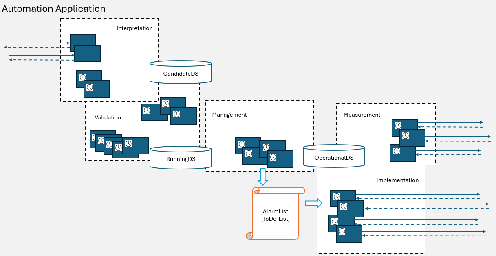
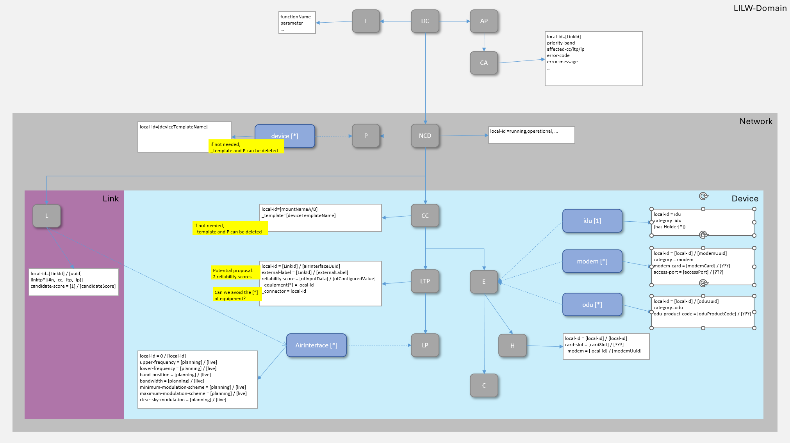

# Information Structure  

The LILW shall implement a state based design that allows defining a target state, which will then be tried to be achieved by the functions of the application.

  

The publicly offered services shall allow changing the content of a CandidateDataStore.  
The content of the CandidateDataStore shall be validated before copying it into the RunningDataStore.  
The RunningDataStore is defining the target state to be achieved with the functions of the LILW.  
The OperationalDataStore is describing the actual state of the MW devices.  

The information within these three data stores shall have the following identical structure (only the semantical meaning differs).  

  

Its top level element is a [DomainController](./schemas/00_DomainController.yaml) that holds the parameter settings of the [Functions](./schemas/01_Function.yaml) and the [CurrentAlarms](./schemas/02_CurrentAlarm.yaml) within the LinkIdintoLtpWriter.  

Apart from that it holds four different documentations of the same [Network](./schemas/03_NetworkControlDomain.yaml) (running, operational, startup and candidate), which is exclusively composed from [Devices](./schemas/31_Device.yaml) that share a couple of different [DeviceTemplates](./schemas/07_DeviceTemplate.yaml).  
