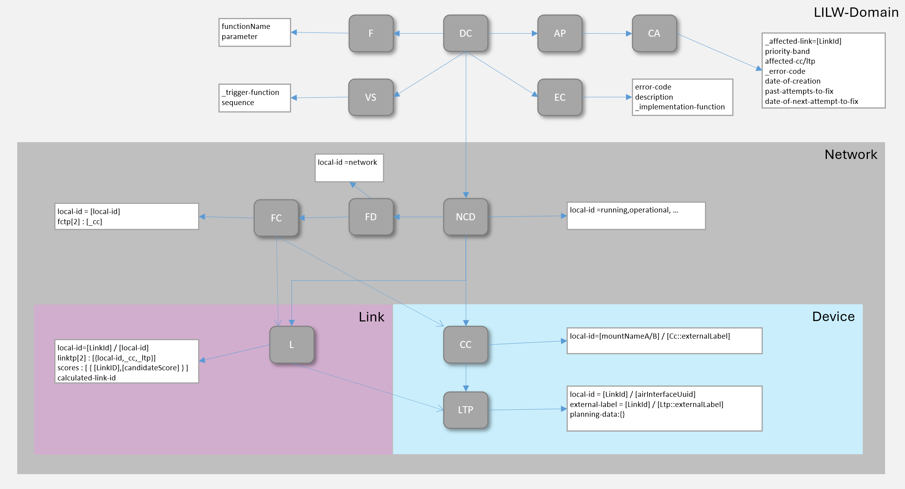

# Information Structure  

The internal data stores shall be structured according to the NMDA concepts ([IETF RFC 8342](https://datatracker.ietf.org/doc/html/rfc8342)).

The specified data stores are assigned the following semantic meanings:  
- The external services (paths at API) shall allow transferring the planning data into the CandidateDataStore.  
- After some validation tests, the planning data shall be copied into the RunningDataStore.  
- The information provided by the devices in the live (via MWDI, mostly from cache) network shall be consolidated into the OperationalDataStore.  

  

This means for the Link objects:  
- A Link object inside the RunningDS is describing a planned microwave link that _is actually_ identified with a LinkID.  
- The Link objects inside the OperationalDS are describing relationships between AirInterface objects that _might_ correspond to a planned microwave link with a specific LinkID.  

Because the devices cannot provide information about the connections in between them, inside the OperationalDS ... 
- ... an AirInterface might be referenced by several Link objects that are connecting it with several other AirInterfaces and ...  
- ... the individual Link object might correspond to diverse planned microwave links.  

  

Each of the Link objects in the OperationalDS defines a set of Scores that assess the likelihood that this Link object corresponds to one of the planned microwave links.

So, the overall problem of writing the most likely LinkID into the externalLabel attribute at some AirInterface is sub-structured into the following activities on the data stores:  
- The respective Score for a Link object in the OperationalDS to correspond to one of the planned microwave links in the RunningDS is estimated. This calculation compares the information about the planned microwave links in RunningDS with the information retrieved from the actual devices in the OperationalDS. The _resulting estimate is documented at the Link object in the OperationalDS_.  
- Based on the estimated Scores, the most likely distribution of the LinkIDs across the Link objects is calculated. Rules (such as: each LinkID may be assigned just once) must be observed. The _resulting assignments of LinkIDs are documented in the calculatedLinkId attribute at the Link object in the OperationalDS_.  
- If there would be differences between the values of the calculatedLinkId attribute at the Link objects and the externalLabel attribute at the AirInterface objects (both in OperationalDS), the values from the calculatedLinkId attribute at the Link objects would have to be configured into the devices.  

The information within the three data stores shall have the following identical structure:  

  

Its top level element is a [DomainController (DC)](./schemas/00_DomainController.yaml) that holds  
- the parameter settings of the [Functions (F)](./schemas/01_Function.yaml),  
- definitions of [ValidationSequences (VS)](./schemas/03_ValidationSequence.yaml),  
- definitions of [ErrorCodes (EC)](./schemas/05_ErrorCode.yaml) including their countermeasures,  
- and the [CurrentAlarms (CA)](./schemas/02_CurrentAlarm.yaml) within the LinkIdintoLtpWriter.  

Apart from that it holds four different documentations of the same [Network (NCD)](./schemas/03_NetworkControlDomain.yaml) (running, operational, startup and candidate), which is composed from  
- [Devices (CC)](./schemas/21_Device.yaml),  
- [NetworkConnections (FC)](./schemas/23_NetworkConnection.yaml)  
- and [AirLinks (L)](./schemas/22_AirLink.yaml).  
